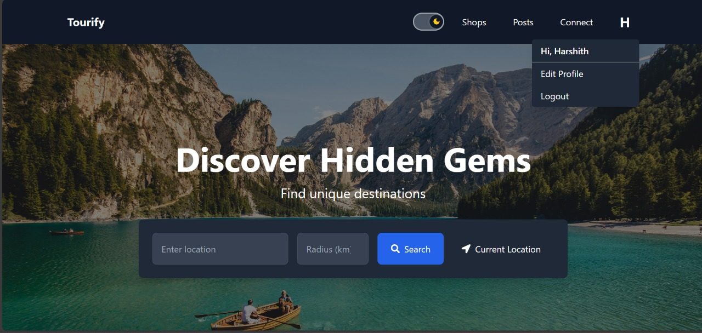

# TravelSphere: AI-Powered Itinerary and Landmark Discovery

TravelSphere is a smart, AI-driven travel planning web application designed to simplify and enhance the experience of trip organization. It leverages advanced AI (including Gemini API), real-time data integrations, and a modern tech stack to generate personalized itineraries, suggest nearby landmarks, provide weather forecasts, and foster social travel planning.

---

## Table of Contents

- [Features](#features)
- [Architecture](#architecture)
- [User Flow](#User-Flow)
- [Tech Stack](#tech-stack)
- [AI Modules](#ai-modules)
- [Screenshots](#screenshots)
- [How It Works](#how-it-works)
- [Installation](#installation)
- [Contributors](#contributors)
- [License](#license)

---

## Features

✅ AI-powered itinerary generation using Gemini API  
✅ Landmark discovery with images and descriptions  
✅ Real-time weather forecast integration  
✅ Optimized route planning (K-Means clustering, nearest-neighbor)  
✅ User authentication and profile management  
✅ Social features for sharing travel posts and connecting with other travelers  
✅ Collaborative trip planning with invitations and community engagement  

---

## Architecture

TravelSphere follows a three-tier architecture:

- **Frontend (React):** User interface with dynamic routing, state management, and direct integration with external APIs for weather and maps.
- **Backend (Node.js with Express):** REST API for business logic, authentication, data management.
- **Database (MongoDB):** NoSQL store for users, posts, itineraries, and connections.

 *(Replace with your actual diagram)*

---

## User Flow Diagram

The user flow diagram illustrates how a user navigates through the TravelSphere web application. It maps out the main steps and decision points across all major features.

### Main Flows

- **Home Page:** The central entry point for new and returning users.
  - Navigate to:
    - Landmark Search
    - Posts Feed
    - Travel Plans

---

### Landmark Search Module
- User enters a location or uses GPS.
- System returns a list of relevant landmarks with images and descriptions.
- User selects landmarks to add to their itinerary.
- Itinerary management is interactive and day-wise:
  - Assign landmarks to specific days.
  - Adjust visit sequence.
  - Include travel details (transport mode, distance, time).
  - View real-time weather for destinations.
- Generate an optimized itinerary.

---

### Posts Feed Module
- View posts shared by other travelers (text, photos, experiences).
- Create and upload your own posts:
  - Compose text.
  - Attach images.
  - Publish to the community.
- Engage by liking or commenting on posts.

---

### Travel Plans Module
- Create a new travel plan:
  - Enter destination, duration, theme.
  - Add participants via email invitations or make the plan public.
- Browse existing travel plans:
  - Filter by budget, duration, popularity.
  - Send join requests.
- Receive notifications when requests are accepted or rejected.
- Coordinate group travel easily.

---

### Key Decision Points
- Add or skip landmarks.
- Edit or delete plans.
- Make plans public or private.
- Join existing plans or create new ones.

---

### User Feedback and Confirmation
- Confirmation screens after saving itineraries.
- Success messages after publishing posts.
- Notifications after joining travel plans.

---

This structured user flow ensures an intuitive, low-friction experience where travelers can plan, customize, share, and collaborate on trips with ease.

## Tech Stack

- **Frontend:** React.js, JavaScript, HTML/CSS
- **Backend:** Node.js, Express.js
- **Database:** MongoDB
- **AI/ML:** Google Gemini API, Prophet (for weather forecasting), K-Means Clustering
- **APIs/Services:**  
  - Google Places API (landmark data)  
  - OpenWeatherMap API (real-time weather)  
  - Cloudinary (media storage)  
  - Pexels API (landmark images)  
  - Open-Meteo API (historical weather data)

---

## AI Modules

### 1️⃣ Landmark Discovery
- Queries Gemini for landmark details given location and radius.
- Fetches images from Pexels.
- Enriches landmarks with descriptions and geolocation metadata.

### 2️⃣ Itinerary Generation
- Clusters landmarks using K-Means for day-wise planning.
- Route optimization using nearest-neighbor algorithm.
- Gemini-based natural language generation for structured itineraries.

### 3️⃣ Weather Forecasting
- Historical weather data pulled from Open-Meteo.
- Forecasts generated for next 90 days using Prophet model.
- Supports user itinerary adjustments based on weather.

---

## Screenshots

- Home Page

- Edit Profile
- Fetch Nearby Landmarks
- Plan Generation
- Comprehensive Plan Description
- Weather Forecast Details
- Connect Feature
- Travel Vlogs / Stories Feed

---

## How It Works

1. **Register/Login:** Secure JWT-based authentication.
2. **Search Landmarks:** By entering location or using GPS. Results enriched with images and reviews.
3. **Plan Itinerary:** AI clusters selected landmarks into daily plans. Route and visit order optimized.
4. **Weather Integration:** Real-time forecasts help adjust plans.
5. **Community Engagement:** Share travel stories, join group plans, or create your own.

---

## Installation

### Prerequisites
- Node.js
- MongoDB

### Steps

1. Clone the repo:
   ```bash
   git clone https://github.com/yourusername/travelsphere.git
   cd travelsphere
Install dependencies:

bash
Copy
Edit
npm install
cd client
npm install
Set up environment variables:

Create .env files in server and client directories.

Include API keys for:

Google Places

OpenWeatherMap

Cloudinary

Gemini API

Pexels

MongoDB URI

Start the backend:

bash
Copy
Edit
npm run server
Start the frontend:

bash
Copy
Edit
cd client
npm start
Future Scope
Advanced AI and ML for deeper personalization.

Offline functionality for itinerary access without connectivity.

Multi-language support for global reach.

Enhanced social features (group chats, travel polls).

Verified user system for safer group planning.


Under the guidance of Dr. Anitha P, Assistant Professor, Department of Information Science and Engineering, Ramaiah Institute of Technology, Bangalore.

License
This project is licensed under [Your License Here].

TravelSphere: Making trip planning smart, social, and effortless.

yaml
Copy
Edit


